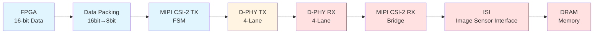
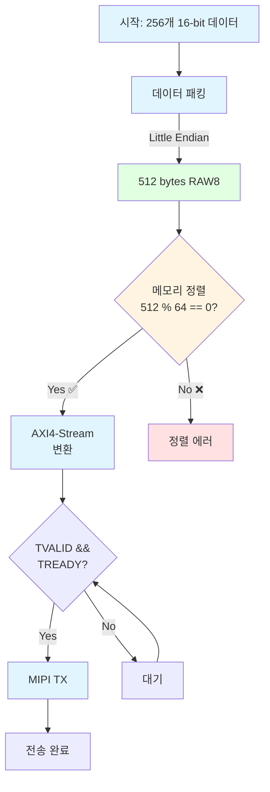
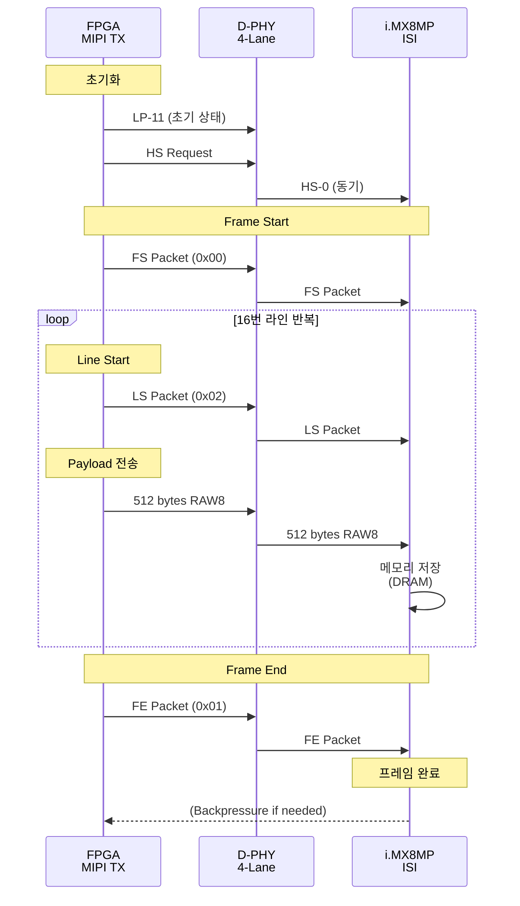
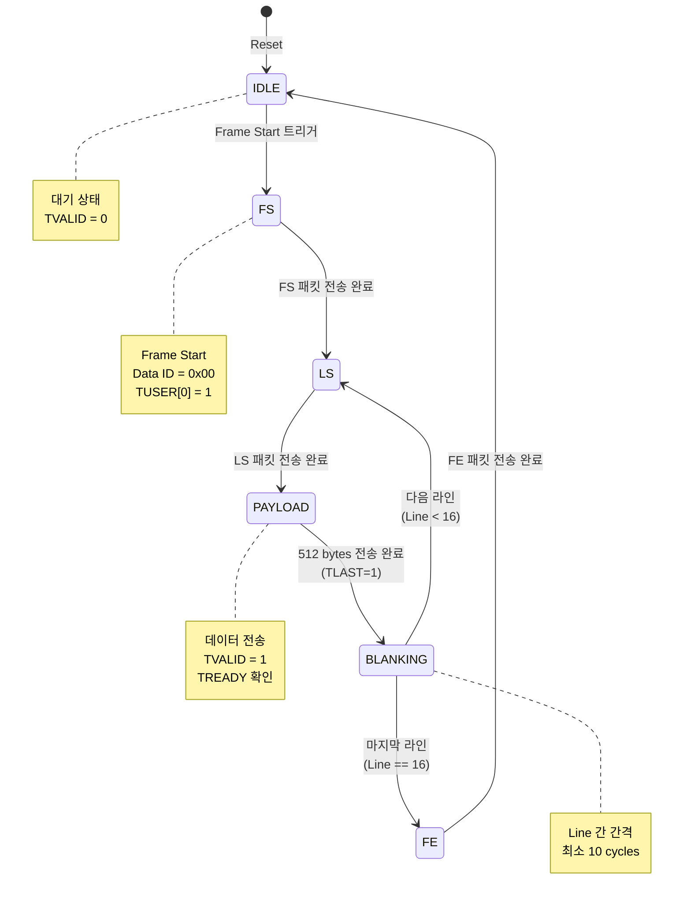
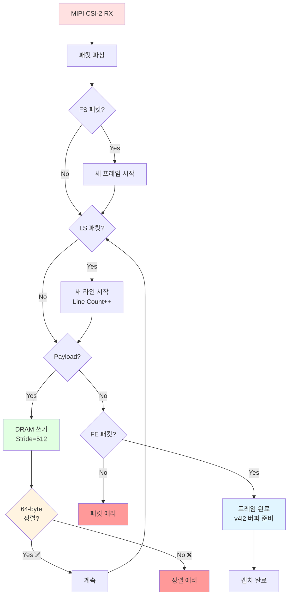
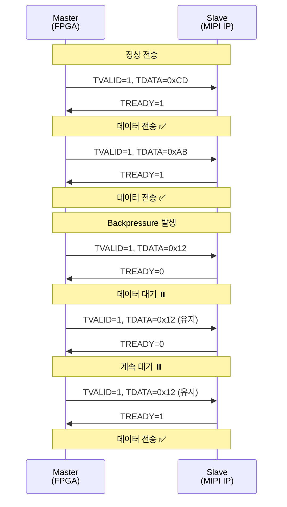
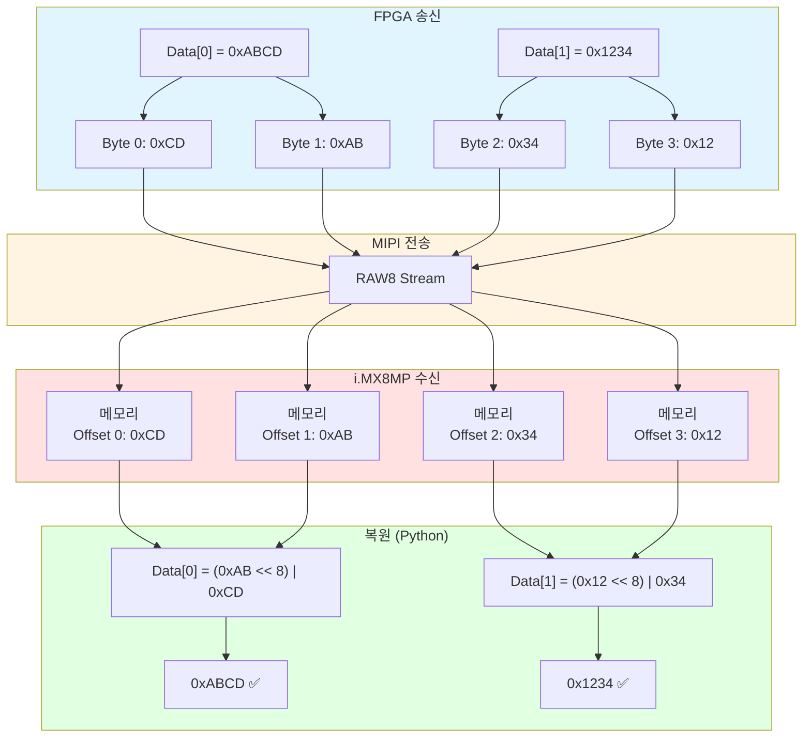
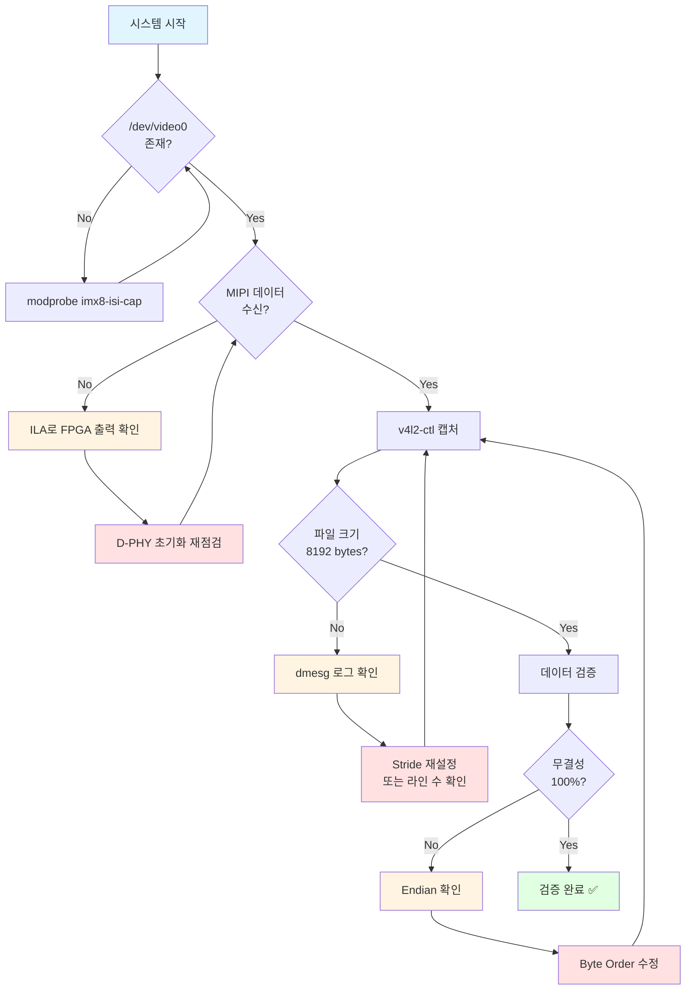
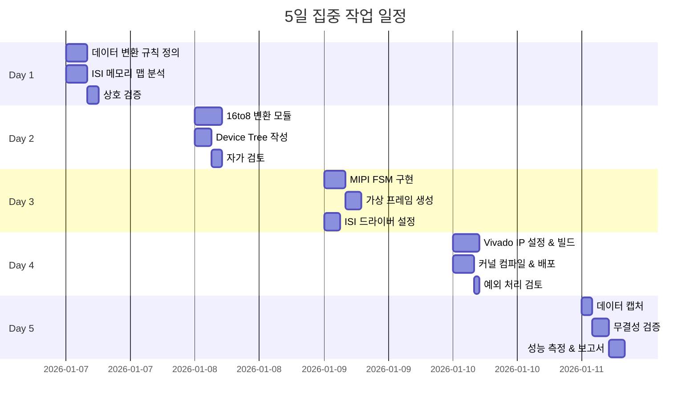
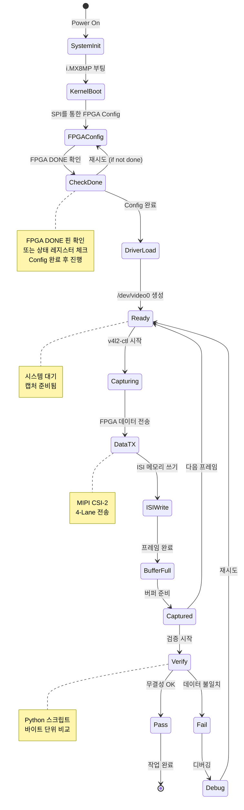

# FPGA-i.MX8MP 시스템 동작 플로우

## 1. 전체 시스템 아키텍처

**범례**:
- 🔵 파란색: FPGA 영역
- 🟡 노란색: 물리 계층 (D-PHY)
- 🔴 빨간색: i.MX8MP 영역

---

## 2. 데이터 변환 플로우

---

## 3. MIPI 프레임 전송 시퀀스

---

## 4. FPGA 내부 FSM 상태 다이어그램

---

## 5. i.MX8MP 데이터 처리 플로우

---

## 6. AXI4-Stream Handshake 타이밍

---

## 7. 메모리 맵 및 데이터 복원

---

## 8. 에러 처리 플로우

---

## 9. 5일 작업 플로우 간트 차트

---

## 10. 시스템 상태 다이어그램 (전체)

---

## 차트 활용 가이드

### VS Code에서 Mermaid 미리보기
1. **Markdown Preview Mermaid Support** 확장 설치
2. `Ctrl+Shift+V`로 미리보기 열기

### GitHub에서 자동 렌더링
- GitHub는 Mermaid를 기본 지원하므로 자동으로 다이어그램 표시

### 온라인 에디터
- https://mermaid.live/ 에서 실시간 편집 및 미리보기
