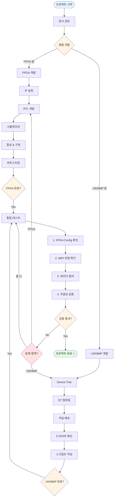
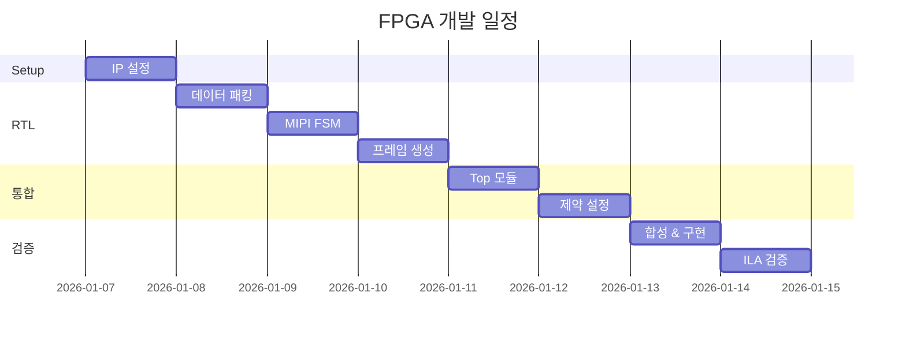
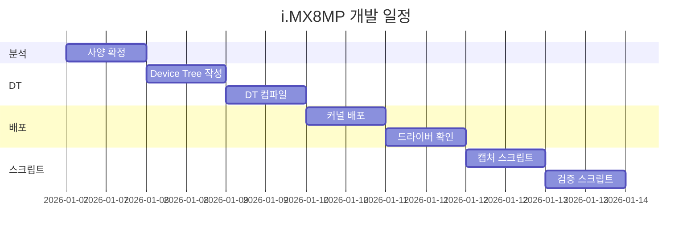
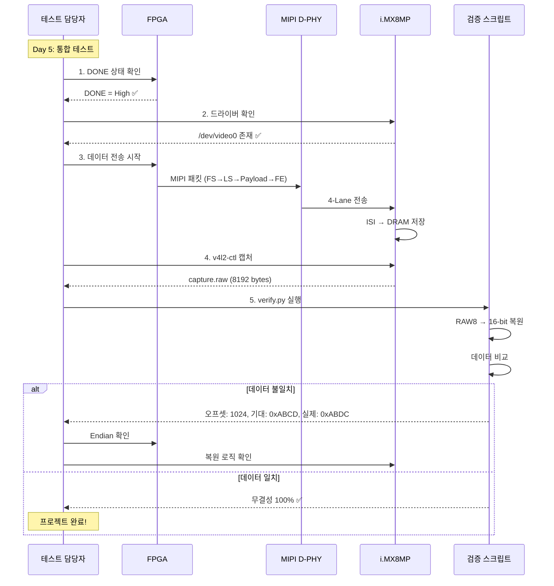

# Source Code Directory

실제 구현 코드를 위한 디렉토리

---

## 🔄 전체 개발 통합 플로우



---

## 🎯 팀별 작업 흐름

### FPGA 팀 (Day 1-4)



### i.MX8MP 팀 (Day 1-4)



---

## 🔍 통합 테스트 플로우



---

## 📁 구조

```
source/
├── fpga/         FPGA (Xilinx Artix-7) 관련 코드
│   ├── rtl/      Verilog/VHDL RTL
│   ├── ip/       Vivado IP 설정
│   ├── constraints/ XDC 제약 파일
│   └── sim/      테스트벤치
│
└── imx8mp/       i.MX8MP 관련 코드
    ├── device-tree/ Device Tree 설정
    ├── scripts/  스크립트 (캡처, 검증)
    └── drivers/  드라이버 (필요 시)
```

---

## 📋 통합 체크리스트

### 사전 준비
- [ ] FPGA 비트스트림 준비 (.bit)
- [ ] i.MX8MP 커널 이미지 준비
- [ ] Device Tree Blob 준비 (.dtb)
- [ ] 검증 스크립트 준비 (capture.sh, verify.py)

### 하드웨어 연결
- [ ] FPGA ↔ i.MX8MP MIPI 연결
- [ ] SPI 연결 (Config용)
- [ ] 전원 및 Clock 연결
- [ ] UART 디버그 연결

### FPGA 측
- [ ] FPGA Configuration 완료
- [ ] DONE 신호 확인
- [ ] ILA 신호 확인 (TVALID, TREADY, TLAST)
- [ ] MIPI 패킷 출력 확인

### i.MX8MP 측
- [ ] 커널 부팅 성공
- [ ] /dev/video0 생성 확인
- [ ] ISI clock 활성화
- [ ] dmesg 에러 없음

### 데이터 검증
- [ ] 파일 크기: 8192 bytes
- [ ] 데이터 무결성: 100%
- [ ] 연속 캡처 성공 (10회 이상)
- [ ] MIPI PHY 에러: 0건

---

## 🚨 통합 테스트 시 주의사항

### FPGA
1. **Configuration 순서 엄수**: i.MX8MP SPI → FPGA Config → DONE 확인
2. **타이밍 검증**: ILA로 AXI Handshake 확인 필수
3. **Clock 안정화**: 최소 10ms 대기 후 데이터 전송

### i.MX8MP
1. **드라이버 로드 확인**: 매 부팅 시 `lsmod` 확인
2. **ISI 초기화**: setup_isi.sh 실행 필수
3. **메모리 정렬**: stride = 512, 64-byte 정렬 재확인

### 통합
1. **점진적 테스트**: 한 프레임씩 확인 후 연속 테스트
2. **로그 수집**: dmesg, ILA 로그 저장
3. **재현성 확보**: 실패 시 재현 가능하도록 조건 기록

---

## 🚀 시작하기

### FPGA 개발
1. [fpga/README.md](fpga/README.md) 참조
2. Task 가이드: [../agent-guide/agent-prompts.md](../agent-guide/agent-prompts.md)
3. 5일 계획: [../agent-guide/todo-list-5days.md](../agent-guide/todo-list-5days.md)

### i.MX8MP 개발
1. [imx8mp/README.md](imx8mp/README.md) 참조
2. Device Tree 가이드: [../agent-guide/agent-prompts.md](../agent-guide/agent-prompts.md)

---

## 📚 참고 문서

**프로젝트 문서**: [../agent-guide/](../agent-guide/) 폴더  
**FPGA 상세**: [fpga/README.md](fpga/README.md)  
**i.MX8MP 상세**: [imx8mp/README.md](imx8mp/README.md)
