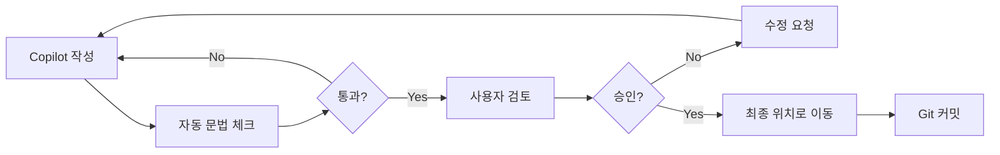

# Copilot Workspace - AI 작업 전용 영역

## 🎯 목적

이 폴더는 **AI Copilot이 코드를 작성하는 전용 공간**입니다.  
작성된 코드를 검토 후, 사용자가 수동으로 최종 위치로 이동시킵니다.

---

## 📁 폴더 구조

```
copilot-workspace/
├── fpga-draft/           # FPGA 코드 작업 공간
│   ├── rtl/              # RTL 코드 draft
│   ├── ip/               # IP 설정 draft
│   ├── constraints/      # 제약 파일 draft
│   └── sim/              # 테스트벤치 draft
│
├── imx8mp-draft/         # i.MX8MP 코드 작업 공간
│   ├── device-tree/      # Device Tree draft
│   ├── scripts/          # 스크립트 draft
│   └── drivers/          # 드라이버 draft
│
├── integration-test/     # 통합 테스트 파일
│   └── test-logs/        # 테스트 로그 보관
│
└── README.md             # 이 파일
```

---

## 🔄 워크플로우

### 1. Copilot 작업 단계
```
사용자 요청 → Copilot이 draft 폴더에 코드 작성 → 완료 알림
```

**예시**:
```
📝 Task: "data_pack_16to8.v 모듈 작성"
   ↓
✅ 생성: copilot-workspace/fpga-draft/rtl/data_pack_16to8.v
   ↓
💬 알림: "코드 작성 완료. 검토 후 승인해주세요."
```

### 2. 사용자 검토 단계
```
Draft 코드 확인 → 시뮬레이션/테스트 → 문제 있으면 수정 요청
```

**체크리스트**:
- [ ] 코드 문법 확인
- [ ] 시뮬레이션 통과 (FPGA)
- [ ] 실행 테스트 (i.MX8MP)
- [ ] 주석 및 문서화 충분
- [ ] 코딩 스타일 일관성

### 3. 승인 및 이동 단계
```
승인 → 사용자가 수동으로 최종 위치로 이동 → Git 커밋
```

**이동 예시**:
```powershell
# FPGA RTL 파일 이동
Move-Item copilot-workspace/fpga-draft/rtl/data_pack_16to8.v source/fpga/rtl/

# Device Tree 파일 이동
Move-Item copilot-workspace/imx8mp-draft/device-tree/*.dts source/imx8mp/device-tree/

# Git 커밋
git add source/fpga/rtl/data_pack_16to8.v
git commit -m "Add data packing module (reviewed and approved)"
```

---

## ⚡ 빠른 명령어

### Copilot에게 작업 요청
```
"copilot-workspace/fpga-draft/rtl/ 에 data_pack_16to8.v 작성해줘"
"copilot-workspace/imx8mp-draft/scripts/ 에 capture.sh 작성해줘"
```

### 파일 이동 (승인 후)
```powershell
# 단일 파일
Move-Item copilot-workspace/fpga-draft/rtl/module.v source/fpga/rtl/

# 여러 파일
Get-ChildItem copilot-workspace/fpga-draft/rtl/*.v | Move-Item -Destination source/fpga/rtl/

# 폴더 전체
Move-Item copilot-workspace/fpga-draft/ip/* source/fpga/ip/
```

### Draft 정리
```powershell
# 이동 완료된 파일 삭제
Remove-Item copilot-workspace/fpga-draft/rtl/data_pack_16to8.v

# 전체 정리 (주의!)
Remove-Item -Recurse copilot-workspace/*/
```

---

## 🎨 상태 표시 규칙

### 파일명 접두사 (선택 사항)
- `DRAFT-` : 작성 중
- `REVIEW-` : 검토 필요
- `APPROVED-` : 승인됨, 이동 대기

**예시**:
```
DRAFT-data_pack_16to8.v       → 작성 중
REVIEW-data_pack_16to8.v      → 검토 요청
APPROVED-data_pack_16to8.v    → 이동 준비 완료
```

### 상태 파일
각 draft 폴더에 `STATUS.md` 생성 가능:
```markdown
# 작업 상태

## 완료
- [x] data_pack_16to8.v (이동 완료: 2026-01-07)

## 검토 중
- [ ] mipi_csi2_tx_fsm.v

## 작업 중
- [ ] frame_generator.v
```

---

## 🔒 Git 관리

### .gitignore 설정 (선택)

**옵션 1: Draft를 Git에 포함**
- 장점: 모든 히스토리 보존
- 단점: 저장소 크기 증가

**옵션 2: Draft를 Git에서 제외**
```gitignore
# .gitignore에 추가
source/copilot-workspace/fpga-draft/
source/copilot-workspace/imx8mp-draft/
source/copilot-workspace/integration-test/test-logs/

# README.md는 포함
!source/copilot-workspace/README.md
```

**추천**: 옵션 1 (모든 히스토리 보존)

---

## 📋 작업 체크리스트 템플릿

### FPGA 모듈 작업
```markdown
- [ ] Copilot이 rtl/ 폴더에 코드 작성
- [ ] 시뮬레이션 테스트벤치 작성
- [ ] Vivado에서 문법 체크
- [ ] 시뮬레이션 실행 및 파형 확인
- [ ] 코드 리뷰 (주석, 스타일)
- [ ] source/fpga/rtl/로 이동
- [ ] Git 커밋
```

### i.MX8MP 스크립트 작업
```markdown
- [ ] Copilot이 scripts/ 폴더에 스크립트 작성
- [ ] Bash 문법 체크 (shellcheck)
- [ ] 테스트 환경에서 실행 테스트
- [ ] 에러 처리 확인
- [ ] 권한 설정 확인 (chmod +x)
- [ ] source/imx8mp/scripts/로 이동
- [ ] Git 커밋
```

---

## 💡 전문가 팁

### 1. 병렬 작업
```
Copilot Task 1: FPGA RTL 작성 (fpga-draft/)
Copilot Task 2: i.MX8MP DT 작성 (imx8mp-draft/)
   ↓
동시에 검토 후 순차적으로 이동
```

### 2. 버전 관리
```
copilot-workspace/fpga-draft/rtl/
├── data_pack_16to8.v
├── data_pack_16to8_v2.v      # 수정 버전
└── data_pack_16to8_final.v   # 최종 버전 (이동 대상)
```

### 3. 테스트 로그 보관
```
integration-test/test-logs/
├── 2026-01-07-fpga-simulation.log
├── 2026-01-08-imx8mp-capture.log
└── 2026-01-09-integration-test.log
```

### 4. 승인 프로세스


---

## 🚀 시작하기

### 첫 작업 예시
1. Copilot에게 요청:
   ```
   "copilot-workspace/fpga-draft/rtl/ 에 16-bit를 8-bit로 변환하는 
   data_pack_16to8.v 모듈을 작성해줘. Little Endian 방식으로."
   ```

2. 작성 완료 후 확인:
   ```powershell
   code copilot-workspace/fpga-draft/rtl/data_pack_16to8.v
   ```

3. 승인 후 이동:
   ```powershell
   Move-Item copilot-workspace/fpga-draft/rtl/data_pack_16to8.v source/fpga/rtl/
   git add source/fpga/rtl/data_pack_16to8.v
   git commit -m "Add 16-to-8 bit data packing module with Little Endian"
   ```

---

## 📞 참고 문서

- **프로젝트 계획**: [../../agent-guide/mipi-project-plan.md](../../agent-guide/mipi-project-plan.md)
- **작업 지침**: [../../agent-guide/agent-prompts.md](../../agent-guide/agent-prompts.md)
- **5일 계획**: [../../agent-guide/todo-list-5days.md](../../agent-guide/todo-list-5days.md)

---

**생성일**: 2026-01-07  
**목적**: 안전하고 체계적인 AI 협업 워크플로우
