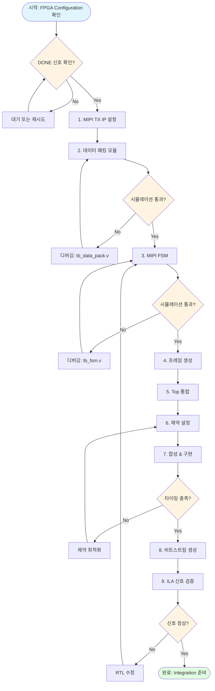
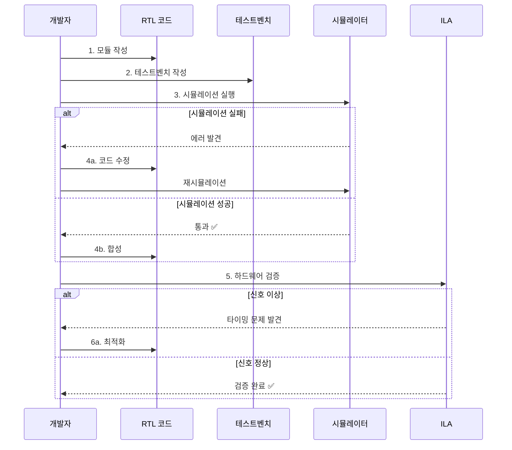
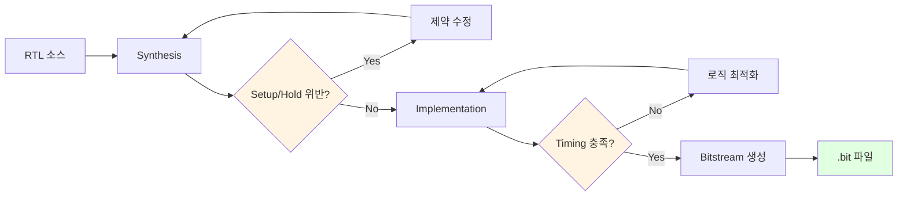

# FPGA Source Code

FPGA(Xilinx Artix-7 XC7A35T) 관련 소스 코드 및 IP 설정

---

## 🔄 FPGA 개발 워크플로우



---

## 🔧 모듈별 개발 플로우

### RTL 개발 단계



### 빌드 플로우



---

## 📁 폴더 구조

```
fpga/
├── rtl/          Verilog/VHDL RTL 코드
├── ip/           Vivado IP 설정 파일 (TCL 스크립트)
├── constraints/  제약 파일 (XDC)
└── sim/          테스트벤치 및 시뮬레이션
```

## 📝 주요 모듈

### rtl/
- `data_pack_16to8.v` - 16-bit → 8-bit 데이터 패킹 모듈
- `mipi_csi2_tx_fsm.v` - MIPI CSI-2 TX FSM
- `frame_generator.v` - 가상 프레임 생성 (16줄 반복)
- `top.v` - Top 모듈

### ip/
- `mipi_csi2_tx_setup.tcl` - MIPI CSI-2 TX Subsystem IP 설정

### constraints/
- `pins.xdc` - 핀 맵핑
- `timing.xdc` - 타이밍 제약

### sim/
- `tb_data_pack.v` - 데이터 패킹 테스트벤치
- `tb_fsm.v` - FSM 테스트벤치

---

## 📋 체크리스트

### IP 설정 (ip/)
- [ ] MIPI CSI-2 TX Subsystem IP 추가
- [ ] 4-Lane, RAW8 (0x2A) 설정
- [ ] D-PHY 타이밍 파라미터 설정
- [ ] Virtual Channel = 0

### RTL 개발 (rtl/)
- [ ] data_pack_16to8.v - Little Endian 변환
- [ ] mipi_csi2_tx_fsm.v - FS/LS/Payload/FE
- [ ] frame_generator.v - 16줄 반복
- [ ] top.v - 통합 모듈

### 제약 (constraints/)
- [ ] pins.xdc - 핀 맵핑 (MIPI, Clock)
- [ ] timing.xdc - 타이밍 제약

### 시뮬레이션 (sim/)
- [ ] tb_data_pack.v - Endian 검증
- [ ] tb_fsm.v - MIPI 패킷 검증
- [ ] 모든 테스트 통과

### 검증
- [ ] ILA로 신호 확인 (TVALID, TREADY, TLAST)
- [ ] 타이밍 에러 없음
- [ ] 리소스 사용률 < 80%

---

## 🐛 자주 발생하는 이슈

| 문제 | 원인 | 해결 |
|------|------|------|
| Setup 위반 | 클럭 주파수 너무 높음 | 클럭 낮추기 또는 파이프라인 추가 |
| FIFO Overflow | Backpressure 미처리 | TREADY 신호 처리 로직 추가 |
| 시뮬레이션 실패 | Endian 변환 오류 | 바이트 순서 재확인 |
| ILA 신호 없음 | Clock 미연결 | 클럭 트리 확인 |

---

## 🎯 개발 가이드

**상세 Task 가이드**: [../../agent-guide/agent-prompts.md](../../agent-guide/agent-prompts.md)  
**5일 계획**: [../../agent-guide/todo-list-5days.md](../../agent-guide/todo-list-5days.md)
