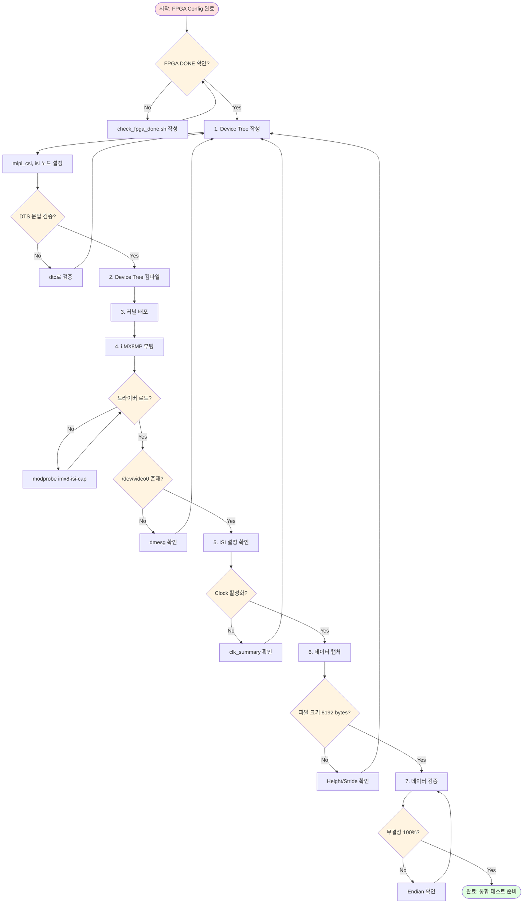
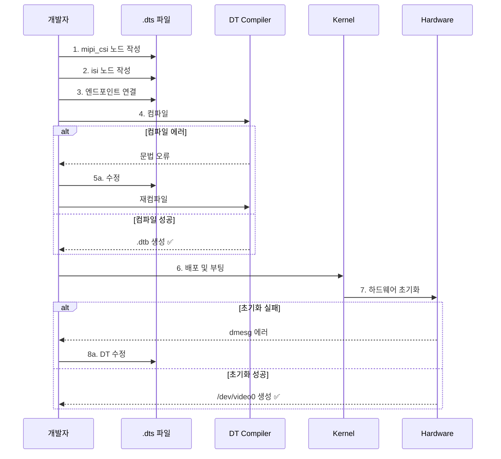
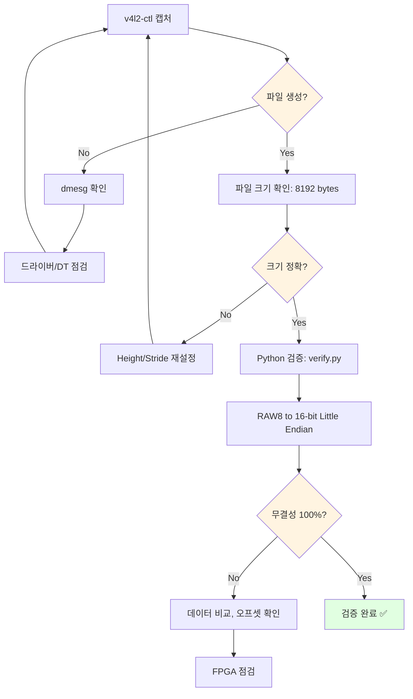

# i.MX8MP Source Code

i.MX8MP 관련 Device Tree, 스크립트, 드라이버

---

## 🔄 i.MX8MP 개발 워크플로우



---

## 🔧 개발 상세 플로우

### Device Tree 작성 프로세스



### 캡처 및 검증 플로우



---

## 📁 폴더 구조

```
imx8mp/
├── device-tree/  Device Tree Source 파일
├── scripts/      캡처 및 검증 스크립트
└── drivers/      커스텀 드라이버 (필요 시)
```

## 📝 주요 파일

### device-tree/
- `imx8mp-mipi-csi2.dts` - MIPI CSI-2 및 ISI 설정
- `imx8mp-overlay.dtso` - Device Tree Overlay

### scripts/
- `capture.sh` - v4l2-ctl 기반 데이터 캡처
- `verify.py` - 데이터 무결성 검증
- `check_fpga_done.sh` - FPGA Configuration 확인
- `setup_isi.sh` - ISI 초기화

### drivers/
- (필요 시 커스텀 드라이버 추가)

---

## 📋 체크리스트

### Device Tree (device-tree/)
- [ ] mipi_csi 노드 설정
  - [ ] data-lanes = <1 2 3 4>
  - [ ] clock-lanes = <0>
- [ ] isi 노드 설정
  - [ ] width = 512, height = 16
  - [ ] stride = 512 (64-byte 정렬)
  - [ ] ISP 우회 설정
- [ ] 엔드포인트 연결
- [ ] .dtb 컴파일 성공

### 스크립트 (scripts/)
- [ ] check_fpga_done.sh - DONE 확인
- [ ] setup_isi.sh - ISI 초기화
- [ ] capture.sh - v4l2-ctl 캡처
- [ ] verify.py - 데이터 검증
  - [ ] Little Endian 변환
  - [ ] 바이트 단위 비교

### 시스템 확인
- [ ] 드라이버 로드: `lsmod | grep imx8_isi`
- [ ] /dev/video0 생성
- [ ] ISI clock 활성화
- [ ] Power domain ON

### 검증
- [ ] 캡처 파일 크기: 8192 bytes
- [ ] 데이터 무결성: 100%
- [ ] MIPI PHY 에러: 0건

---

## 🐛 자주 발생하는 이슈

| 문제 | 원인 | 해결 |
|------|------|------|
| /dev/video0 없음 | 드라이버 미로드 | `modprobe imx8-isi-cap` |
| dmesg 에러 | DT 설정 오류 | mipi_csi/isi 노드 재확인 |
| 파일 크기 0 | MIPI 데이터 미수신 | FPGA 출력 확인 (ILA) |
| 데이터 불일치 | Endian 오류 | verify.py 변환 로직 점검 |
| 정렬 에러 | stride 미정렬 | `512 % 64 = 0` 확인 |

---

## 💡 핵심 명령어

### 시스템 확인
```bash
# 비디오 노드
ls -l /dev/video*

# 드라이버
lsmod | grep imx8_isi

# ISI clock
cat /sys/kernel/debug/clk/clk_summary | grep isi

# 파이프라인
media-ctl -p
```

### 캡처
```bash
# RAW8 캡처
v4l2-ctl --device /dev/video0 \
  --set-fmt-video=width=512,height=16,pixelformat=BA81 \
  --stream-mmap --stream-to=capture.raw --stream-count=1

# 크기 확인
ls -l capture.raw  # 8192 bytes
```

### 검증
```bash
# Python 검증
python3 scripts/verify.py capture.raw

# dmesg 로그
dmesg | tail -50
dmesg | grep -i mipi
dmesg | grep -i isi
```

---

## 🎯 개발 가이드

**상세 Task 가이드**: [../../agent-guide/agent-prompts.md](../../agent-guide/agent-prompts.md)  
**5일 계획**: [../../agent-guide/todo-list-5days.md](../../agent-guide/todo-list-5days.md)
